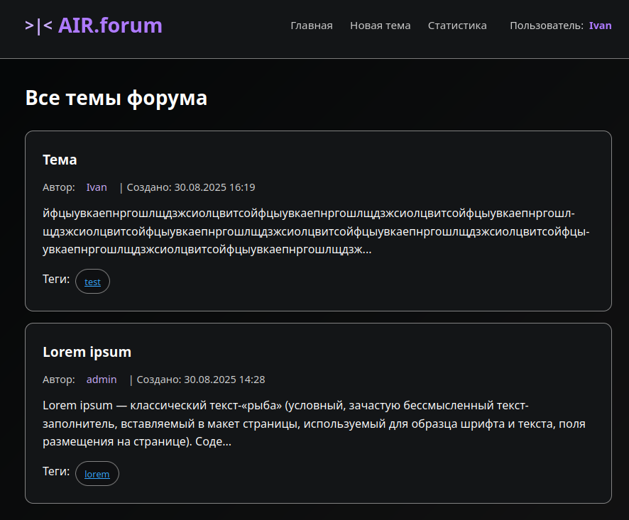
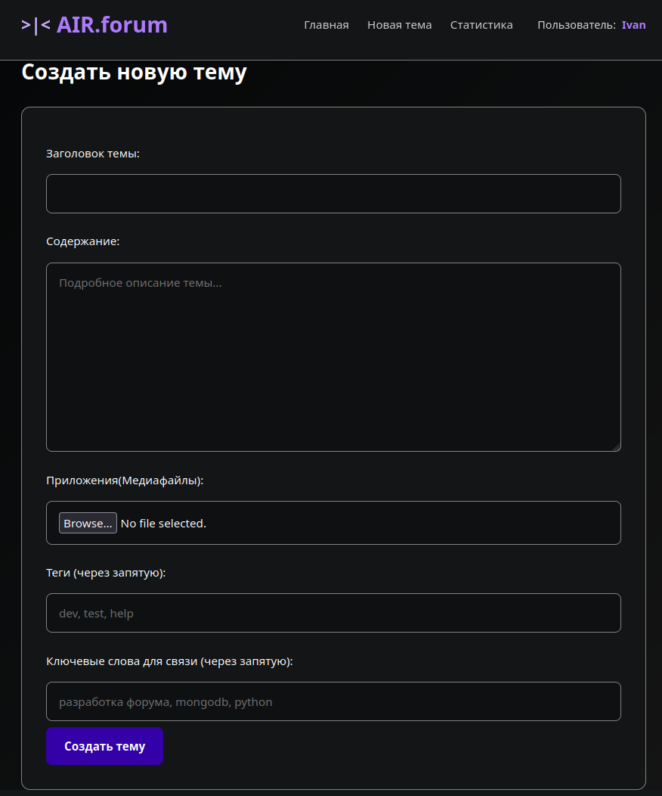
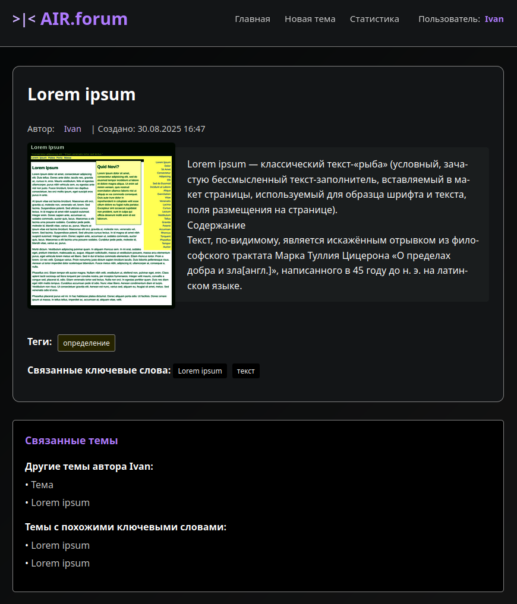

# Forum Platform

## Техническое описание

Форумная платформа построена на асинхронном веб-фреймворке FastAPI с использованием MongoDB в качестве основной базы данных. Архитектура реализует RESTful API с серверным рендерингом через Jinja2 Templates.

### Технологический стек

**Backend Framework:** FastAPI с асинхронной обработкой запросов
**База данных:** MongoDB с Motor драйвером для асинхронных операций
**Шаблонизатор:** Jinja2 Templates
**Обработка файлов:** FastAPI UploadFile

### Архитектура

Проект использует модульную структуру с разделением на следующие компоненты:
- **Routes**: API endpoints для обработки HTTP запросов
- **Database**: Слой взаимодействия с MongoDB
- **Models**: Схемы для валидации данных
- **Graph**: Модуль построения связей между сущностями
- **Utils**: Вспомогательные функции

### Структура данных

**Topics Collection**: Хранение тем с полями title, content, author, tags, links, media
**Users Collection**: Агрегация пользователей с счетчиками активности  
**Tags Collection**: Индексация тегов с метриками использования

Медиафайлы сохраняются как MongoDB Binary объекты.

## Функциональные возможности

**Управление темами**: Создание, просмотр, категоризация тем форума
**Медиа поддержка**: Загрузка и отображение медипфайлов
**Система тегов**: Классификация контента по категориям
**Граф связей**: Автоматическое определение связанных тем по автору, тегам и контенту
**Полнотекстовый поиск**: Индексирование и поиск по содержимому тем

## Скриншоты

